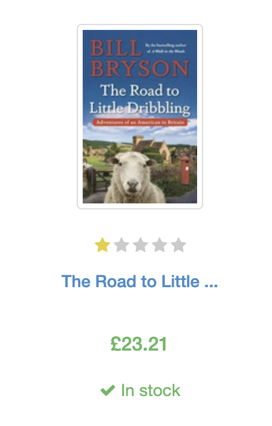
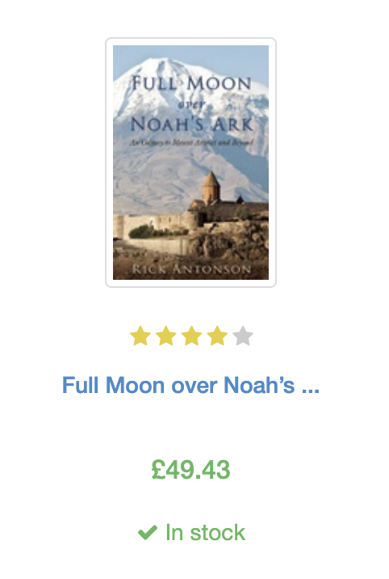
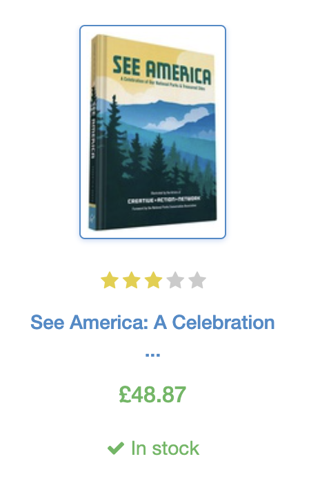
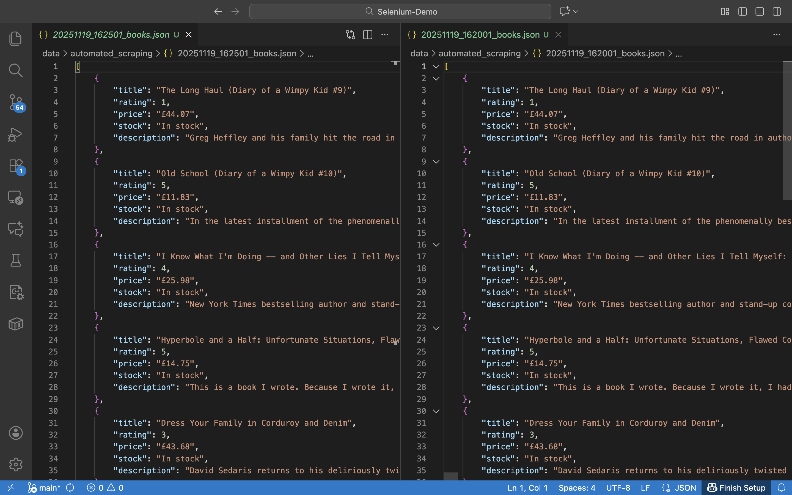

# Selenium Demo

<a id="readme-top"></a>

<details>
  <summary>Table of Contents</summary>
  <ol>
    <li><a href="#quotes">Quotes</a></li>
    <li><a href="#books">Books</a></li>
    <li><a href="#scraping-books-with-certain-conditions">Scraping books with certain conditions</a></li>
    <li><a href="#automated-scraping-with-selenium-airflow-and-docker">Automated Scraping with Selenium, Airflow and Docker</a></li>
    <li><a href="#crawling-data-from-vietrace365-with-selenium-airflow-and-docker">Crawling data from Vietrace365 with Selenium, Airflow and Docker</a></li>
  </ol>
</details>

A demo application using Selenium to crawl data from a website. This demo is done in Brave Browser, by using Chromedriver with Brave binary.

Websites to crawl:
- https://quotes.toscrape.com/
- https://books.toscrape.com/

**NOTE**: Prices and ratings of books were randomly assigned and have no real meaning.

Data crawled is in the `data` folder, while log files are in the `logs` folder.

## Quotes

Steps to collect quotes:
1. Navigate to  https://quotes.toscrape.com/
2. Create a loop through every pages.
3. For each quote inside a page, crawl the quote, its author, and its tags using CSS Selector for HTML elements.
4. Strip unnecessary double-quotes from each quote.
5. Check the next page:
	1. If there is a next page, navigate to it.
	2. Otherwise, we're in the last page. Break the loop.
6. Quit the browser.

Number of quotes collected: 100 quotes.
For each quote:
- Content
- Author
- Tags

A quote example:

```json
{
	"Text": "It is not a lack of love, but a lack of friendship that makes unhappy marriages.",
	"Author": "Friedrich Nietzsche",
	"Tags": [
		"friendship",
		"lack-of-friendship",
		"lack-of-love",
		"love",
		"marriage",
		"unhappy-marriage"
	]
}
```

<p align="right"><a href="#readme-top">back to top</a></p>

## Books

Steps to collect quotes:
1. Navigate to  https://books.toscrape.com/
2. Collect all categories from the main page.
3. Create a loop through every categories.
4. For each category, loop through every pages.
5. For each book inside a page, crawl the book title, description, ratings, price, stock (whether it is in stock or not) using CSS Selector for HTML elements.
6. Check the next page (this is done for each category):
	1. If there is a next page, navigate to it.
	2. Otherwise, we're in the last page. Break the loop and move on to the next category.
7. Quit the browser.

Number of books collected: 1000 books.
For each book:
- Title
- Rating (1-5 stars)
- Price (in GBP)
- Stock (Are there any books left in stock?)
- Description of the books

A book example:

```json
{
	"title": "A Flight of Arrows (The Pathfinders #2)",
	"rating": 5,
	"price": "£55.53",
	"stock": "In stock",
	"description": "October 1776--August 1777It is said that what a man sows he will reap--and for such a harvest there is no set season. No one connected to Reginald Aubrey is untouched by the crime he committed twenty years ago. Not William, the Oneida child Reginald stole and raised as his own. Identity shattered, enlisted in the British army, William trains with Loyalist refugees eager to October 1776--August 1777It is said that what a man sows he will reap--and for such a harvest there is no set season. No one connected to Reginald Aubrey is untouched by the crime he committed twenty years ago. Not William, the Oneida child Reginald stole and raised as his own. Identity shattered, enlisted in the British army, William trains with Loyalist refugees eager to annihilate the rebels who forced them into exile. Coming to terms with who and what he is proves impossible, but if he breaks his Loyalist oath, he'll be no better than the man who constructed his life of lies.Not Anna, Reginald's adopted daughter, nor Two Hawks, William's twin, both who long for Reginald to accept their love despite the challenges they will face, building a marriage that bridges two cultures. Not Good Voice and Stone Thrower, freed of bitterness by a courageous act of forgiveness, but still yearning for their firstborn son and fearful for the future of their Oneida people.As the British prepare to attack frontier New York and Patriot regiments rally to defend it, two families separated by culture, united by love, will do all in their power to reclaim the son marching toward them in the ranks of their enemies. ...more"
}
```

<p align="right"><a href="#readme-top">back to top</a></p>

## Scraping books with certain conditions

We scraped Travel books from [here](https://books.toscrape.com/catalogue/category/books/travel_2/index.html) with the following conditions
- Bad books: Books that are rated below 3 stars.
- Cheap books: Books that have price lower than £40.00 .
- Colon books: Books that have ":" in their titles.

This is the result:

`Bad books`
```JSON
[
    {
        "title": "It's Only the Himalayas",
        "rating": 2,
        "price": "£45.17",
        "stock": "In stock",
        "description": "Wherever you go, whatever you do, just . . . don’t do anything stupid.” —My MotherDuring her yearlong adventure backpacking from South Africa to Singapore, S. Bedford definitely did a few things her mother might classify as \"stupid.\" She swam with great white sharks in South Africa, ran from lions in Zimbabwe, climbed a Himalayan mountain without training in Nepal, and wa “Wherever you go, whatever you do, just . . . don’t do anything stupid.” —My MotherDuring her yearlong adventure backpacking from South Africa to Singapore, S. Bedford definitely did a few things her mother might classify as \"stupid.\" She swam with great white sharks in South Africa, ran from lions in Zimbabwe, climbed a Himalayan mountain without training in Nepal, and watched as her friend was attacked by a monkey in Indonesia.But interspersed in those slightly more crazy moments, Sue Bedfored and her friend \"Sara the Stoic\" experienced the sights, sounds, life, and culture of fifteen countries. Joined along the way by a few friends and their aging fathers here and there, Sue and Sara experience the trip of a lifetime. They fall in love with the world, cultivate an appreciation for home, and discover who, or what, they want to become.It's Only the Himalayas is the incredibly funny, sometimes outlandish, always entertaining confession of a young backpacker that will inspire you to take your own adventure. ...more"
    },
    {
        "title": "Vagabonding: An Uncommon Guide to the Art of Long-Term World Travel",
        "rating": 2,
        "price": "£36.94",
        "stock": "In stock",
        "description": "With a new foreword by Tim Ferriss •There’s nothing like vagabonding: taking time off from your normal life—from six weeks to four months to two years—to discover and experience the world on your own terms. In this one-of-a-kind handbook, veteran travel writer Rolf Potts explains how anyone armed with an independent spirit can achieve the dream of extended overseas travel. With a new foreword by Tim Ferriss • There’s nothing like vagabonding: taking time off from your normal life—from six weeks to four months to two years—to discover and experience the world on your own terms. In this one-of-a-kind handbook, veteran travel writer Rolf Potts explains how anyone armed with an independent spirit can achieve the dream of extended overseas travel. Now completely revised and updated, Vagabonding is an accessible and inspiring guide to   • financing your travel time • determining your destination • adjusting to life on the road • working and volunteering overseas • handling travel adversity • re-assimilating back into ordinary life  Praise for Vagabonding  “A crucial reference for any budget wanderer.”—Time  “Vagabonding easily remains in my top-10 list of life-changing books. Why? Because one incredible trip, especially a long-term trip, can change your life forever. And Vagabonding teaches you how to travel (and think), not just for one trip, but for the rest of your life.”—Tim Ferriss, from the foreword   “The book is a meditation on the joys of hitting the road. . . . It’s also a primer for those with a case of pent-up wanderlust seeking to live the dream.”—USA Today   “I couldn’t put this book down. It’s a whole different ethic of travel. . . . [Potts’s] practical advice might just convince you to enjoy that open-ended trip of a lifetime.”—Rick Steves   “Potts wants us to wander, to explore, to embrace the unknown, and, finally, to take our own damn time about it. I think this is the most sensible book of travel-related advice ever written.”—Tim Cahill, founding editor of Outside ...more"
    },
    {
        "title": "A Summer In Europe",
        "rating": 2,
        "price": "£44.34",
        "stock": "In stock",
        "description": "On her thirtieth birthday, Gwendolyn Reese receives an unexpected present from her widowed Aunt Bea: a grand tour of Europe in the company of Bea's Sudoku and Mahjongg Club. The prospect isn't entirely appealing. But when the gift she is expecting--an engagement ring from her boyfriend--doesn't materialize, Gwen decides to go. At first, Gwen approaches the trip as if it's On her thirtieth birthday, Gwendolyn Reese receives an unexpected present from her widowed Aunt Bea: a grand tour of Europe in the company of Bea's Sudoku and Mahjongg Club. The prospect isn't entirely appealing. But when the gift she is expecting--an engagement ring from her boyfriend--doesn't materialize, Gwen decides to go. At first, Gwen approaches the trip as if it's the math homework she assigns her students, diligently checking monuments off her must-see list. But amid the bougainvillea and stunning vistas of southern Italy, something changes. Gwen begins to live in the moment--skipping down stone staircases in Capri, running her fingers over a glacier in view of the Matterhorn, racing through the Louvre, and taste-testing pastries at a Marseilles cafe. Reveling in every new experience--especially her attraction to a charismatic British physics professor--Gwen discovers that the ancient wonders around her are nothing compared to the renaissance unfolding within. . . \"A thinking woman's love story, it swept me away to breathtaking places with a cast of endearing characters I won't soon forget. Bravissima!\" Susan McBride, author of \"Little Black Dress\" Praise for Marilyn Brant's According to Jane \"A warm, witty and charmingly original story.\" --Susan Wiggs, \"New York Times \" bestselling author \"Brant infuses her sweetly romantic and delightfully clever tale with just the right dash of Austen-esque wit.\" \"Chicago Tribune\" \"An engaging read for all who have been through the long, dark, dating wars, and still believe there's sunshine, and a Mr. Darcy, at the end of the tunnel.\" --Cathy Lamb, author of \"Such a Pretty Face\"\" ...more"
    },
    {
        "title": "The Great Railway Bazaar",
        "rating": 1,
        "price": "£30.54",
        "stock": "In stock",
        "description": "First published more than thirty years ago, Paul Theroux's strange, unique, and hugely entertaining railway odyssey has become a modern classic of travel literature. Here Theroux recounts his early adventures on an unusual grand continental tour. Asia's fabled trains -- the Orient Express, the Khyber Pass Local, the Frontier Mail, the Golden Arrow to Kuala Lumpur, the Mand First published more than thirty years ago, Paul Theroux's strange, unique, and hugely entertaining railway odyssey has become a modern classic of travel literature. Here Theroux recounts his early adventures on an unusual grand continental tour. Asia's fabled trains -- the Orient Express, the Khyber Pass Local, the Frontier Mail, the Golden Arrow to Kuala Lumpur, the Mandalay Express, the Trans-Siberian Express -- are the stars of a journey that takes him on a loop eastbound from London's Victoria Station to Tokyo Central, then back from Japan on the Trans-Siberian. Brimming with Theroux's signature humor and wry observations, this engrossing chronicle is essential reading for both the ardent adventurer and the armchair traveler. ...more"
    },
    {
        "title": "The Road to Little Dribbling: Adventures of an American in Britain (Notes From a Small Island #2)",
        "rating": 1,
        "price": "£23.21",
        "stock": "In stock",
        "description": "The hilarious and loving sequel to a hilarious and loving classic of travel writing: Notes from a Small Island, Bill Bryson’s valentine to his adopted country of EnglandIn 1995 Bill Bryson got into his car and took a weeks-long farewell motoring trip about England before moving his family back to the United States. The book about that trip, Notes from a Small Island, is up The hilarious and loving sequel to a hilarious and loving classic of travel writing: Notes from a Small Island, Bill Bryson’s valentine to his adopted country of EnglandIn 1995 Bill Bryson got into his car and took a weeks-long farewell motoring trip about England before moving his family back to the United States. The book about that trip, Notes from a Small Island, is uproarious and endlessly endearing, one of the most acute and affectionate portrayals of England in all its glorious eccentricity ever written. Two decades later, he set out again to rediscover that country, and the result is The Road to Little Dribbling. Nothing is funnier than Bill Bryson on the road—prepare for the total joy and multiple episodes of unseemly laughter. ...more"
    }
]
```

|  |  |  |  |  |
| -------------------- | -------------------- | -------------------- | -------------------- | -------------------- |


`Cheap books`
```JSON
[
    {
        "title": "Vagabonding: An Uncommon Guide to the Art of Long-Term World Travel",
        "rating": 2,
        "price": "£36.94",
        "stock": "In stock",
        "description": "With a new foreword by Tim Ferriss •There’s nothing like vagabonding: taking time off from your normal life—from six weeks to four months to two years—to discover and experience the world on your own terms. In this one-of-a-kind handbook, veteran travel writer Rolf Potts explains how anyone armed with an independent spirit can achieve the dream of extended overseas travel. With a new foreword by Tim Ferriss • There’s nothing like vagabonding: taking time off from your normal life—from six weeks to four months to two years—to discover and experience the world on your own terms. In this one-of-a-kind handbook, veteran travel writer Rolf Potts explains how anyone armed with an independent spirit can achieve the dream of extended overseas travel. Now completely revised and updated, Vagabonding is an accessible and inspiring guide to   • financing your travel time • determining your destination • adjusting to life on the road • working and volunteering overseas • handling travel adversity • re-assimilating back into ordinary life  Praise for Vagabonding  “A crucial reference for any budget wanderer.”—Time  “Vagabonding easily remains in my top-10 list of life-changing books. Why? Because one incredible trip, especially a long-term trip, can change your life forever. And Vagabonding teaches you how to travel (and think), not just for one trip, but for the rest of your life.”—Tim Ferriss, from the foreword   “The book is a meditation on the joys of hitting the road. . . . It’s also a primer for those with a case of pent-up wanderlust seeking to live the dream.”—USA Today   “I couldn’t put this book down. It’s a whole different ethic of travel. . . . [Potts’s] practical advice might just convince you to enjoy that open-ended trip of a lifetime.”—Rick Steves   “Potts wants us to wander, to explore, to embrace the unknown, and, finally, to take our own damn time about it. I think this is the most sensible book of travel-related advice ever written.”—Tim Cahill, founding editor of Outside ...more"
    },
    {
        "title": "Under the Tuscan Sun",
        "rating": 3,
        "price": "£37.33",
        "stock": "In stock",
        "description": "A CLASSIC FROM THE BESTSELLING AUTHOR OF UNDER MAGNOLIAFrances Mayes—widely published poet, gourmet cook, and travel writer—opens the door to a wondrous new world when she buys and restores an abandoned villa in the spectacular Tuscan countryside. In evocative language, she brings the reader along as she discovers the beauty and simplicity of life in Italy. Mayes also crea A CLASSIC FROM THE BESTSELLING AUTHOR OF UNDER MAGNOLIAFrances Mayes—widely published poet, gourmet cook, and travel writer—opens the door to a wondrous new world when she buys and restores an abandoned villa in the spectacular Tuscan countryside. In evocative language, she brings the reader along as she discovers the beauty and simplicity of life in Italy. Mayes also creates dozens of delicious seasonal recipes from her traditional kitchen and simple garden, all of which she includes in the book. Doing for Tuscany what M.F.K. Fisher and Peter Mayle did for Provence, Mayes writes about the tastes and pleasures of a foreign country with gusto and passion. ...more"
    },
    {
        "title": "The Great Railway Bazaar",
        "rating": 1,
        "price": "£30.54",
        "stock": "In stock",
        "description": "First published more than thirty years ago, Paul Theroux's strange, unique, and hugely entertaining railway odyssey has become a modern classic of travel literature. Here Theroux recounts his early adventures on an unusual grand continental tour. Asia's fabled trains -- the Orient Express, the Khyber Pass Local, the Frontier Mail, the Golden Arrow to Kuala Lumpur, the Mand First published more than thirty years ago, Paul Theroux's strange, unique, and hugely entertaining railway odyssey has become a modern classic of travel literature. Here Theroux recounts his early adventures on an unusual grand continental tour. Asia's fabled trains -- the Orient Express, the Khyber Pass Local, the Frontier Mail, the Golden Arrow to Kuala Lumpur, the Mandalay Express, the Trans-Siberian Express -- are the stars of a journey that takes him on a loop eastbound from London's Victoria Station to Tokyo Central, then back from Japan on the Trans-Siberian. Brimming with Theroux's signature humor and wry observations, this engrossing chronicle is essential reading for both the ardent adventurer and the armchair traveler. ...more"
    },
    {
        "title": "The Road to Little Dribbling: Adventures of an American in Britain (Notes From a Small Island #2)",
        "rating": 1,
        "price": "£23.21",
        "stock": "In stock",
        "description": "The hilarious and loving sequel to a hilarious and loving classic of travel writing: Notes from a Small Island, Bill Bryson’s valentine to his adopted country of EnglandIn 1995 Bill Bryson got into his car and took a weeks-long farewell motoring trip about England before moving his family back to the United States. The book about that trip, Notes from a Small Island, is up The hilarious and loving sequel to a hilarious and loving classic of travel writing: Notes from a Small Island, Bill Bryson’s valentine to his adopted country of EnglandIn 1995 Bill Bryson got into his car and took a weeks-long farewell motoring trip about England before moving his family back to the United States. The book about that trip, Notes from a Small Island, is uproarious and endlessly endearing, one of the most acute and affectionate portrayals of England in all its glorious eccentricity ever written. Two decades later, he set out again to rediscover that country, and the result is The Road to Little Dribbling. Nothing is funnier than Bill Bryson on the road—prepare for the total joy and multiple episodes of unseemly laughter. ...more"
    },
    {
        "title": "Neither Here nor There: Travels in Europe",
        "rating": 3,
        "price": "£38.95",
        "stock": "In stock",
        "description": "Bill Bryson's first travel book, The Lost Continent, was unanimously acclaimed as one of the funniest books in years. In Neither Here nor There he brings his unique brand of humour to bear on Europe as he shoulders his backpack, keeps a tight hold on his wallet, and journeys from Hammerfest, the northernmost town on the continent, to Istanbul on the cusp of Asia. Fluent in Bill Bryson's first travel book, The Lost Continent, was unanimously acclaimed as one of the funniest books in years. In Neither Here nor There he brings his unique brand of humour to bear on Europe as he shoulders his backpack, keeps a tight hold on his wallet, and journeys from Hammerfest, the northernmost town on the continent, to Istanbul on the cusp of Asia. Fluent in, oh, at least one language, he retraces his travels as a student twenty years before.Whether braving the homicidal motorist of Paris, being robbed by gypsies in Florence, attempting not to order tripe and eyeballs in a German restaurant, window-shopping in the sex shops of the Reeperbahn or disputing his hotel bill in Copenhagen, Bryson takes in the sights, dissects the culture and illuminates each place and person with his hilariously caustic observations. He even goes to Liechtenstein. ...more"
    },
    {
        "title": "1,000 Places to See Before You Die",
        "rating": 5,
        "price": "£26.08",
        "stock": "In stock",
        "description": "Around the World, continent by continent, here is the best the world has to offer: 1,000 places guaranteed to give travelers the shivers. Sacred ruins, grand hotels, wildlife preserves, hilltop villages, snack shacks, castles, festivals, reefs, restaurants, cathedrals, hidden islands, opera houses, museums, and more. Each entry tells exactly why it's essential to visit. Th Around the World, continent by continent, here is the best the world has to offer: 1,000 places guaranteed to give travelers the shivers. Sacred ruins, grand hotels, wildlife preserves, hilltop villages, snack shacks, castles, festivals, reefs, restaurants, cathedrals, hidden islands, opera houses, museums, and more. Each entry tells exactly why it's essential to visit. Then come the nuts and bolts: addresses, websites, phone and fax numbers, best times to visit. Stop dreaming and get going.This hefty volume reminds vacationers that hot tourist spots are small percentage of what's worth seeing out there. A quick sampling: Venice's Cipriani Hotel; California's Monterey Peninsula; the Lewis and Clark Trail in Oregon; the Great Wall of China; Robert Louis Stevenson's home in Western Samoa; and the Alhambra in Andalusia, Spain. Veteran travel guide writer Schultz divides the book geographically, presenting a little less than a page on each location. Each entry lists exactly where to find the spot (e.g. Moorea is located \"12 miles/19 km northwest of Tahiti; 10 minutes by air, 1 hour by boat\") and when to go (e.g., if you want to check out The Complete Fly Fisher hotel in Montana, \"May and Sept.-Oct. offer productive angling in a solitary setting\"). This is an excellent resource for the intrepid traveler.Copyright 2003 Reed Business Information, Inc. ...more"
    }
]
```

|  |  |  |  |  |  |
| -------------------- | -------------------- | -------------------- | -------------------- | -------------------- | -------------------- |


`Colon books`
```JSON
[
    {
        "title": "Full Moon over Noah’s Ark: An Odyssey to Mount Ararat and Beyond",
        "rating": 4,
        "price": "£49.43",
        "stock": "In stock",
        "description": "Acclaimed travel writer Rick Antonson sets his adventurous compass on Mount Ararat, exploring the region’s long history, religious mysteries, and complex politics.Mount Ararat is the most fabled mountain in the world. For millennia this massif in eastern Turkey has been rumored as the resting place of Noah’s Ark following the Great Flood. But it also plays a significant ro Acclaimed travel writer Rick Antonson sets his adventurous compass on Mount Ararat, exploring the region’s long history, religious mysteries, and complex politics.Mount Ararat is the most fabled mountain in the world. For millennia this massif in eastern Turkey has been rumored as the resting place of Noah’s Ark following the Great Flood. But it also plays a significant role in the longstanding conflict between Turkey and Armenia.Author Rick Antonson joined a five-member expedition to the mountain’s nearly 17,000-foot summit, trekking alongside a contingent of Armenians, for whom Mount Ararat is the stolen symbol of their country. Antonson weaves vivid historical anecdote with unexpected travel vignettes, whether tracing earlier mountaineering attempts on the peak, recounting the genocide of Armenians and its unresolved debate, or depicting the Kurds’ ambitions for their own nation’s borders, which some say should include Mount Ararat.What unfolds in Full Moon Over Noah’s Ark is one man’s odyssey, a tale told through many stories. Starting with the flooding of the Black Sea in 5600 BCE, through to the Epic of Gilgamesh and the contrasting narratives of the Great Flood known to followers of the Judaic, Christian and Islamic religions, Full Moon Over Noah’s Ark takes readers along with Antonson through the shadows and broad landscapes of Turkey, Iraq, Iran and Armenia, shedding light on a troubled but fascinating area of the world. ...more"
    },
    {
        "title": "See America: A Celebration of Our National Parks & Treasured Sites",
        "rating": 3,
        "price": "£48.87",
        "stock": "In stock",
        "description": "To coincide with the 2016 centennial anniversary of the National Parks Service, the Creative Action Network has partnered with the National Parks Conservation Association to revive and reimagine the legacy of WPA travel posters. Artists from all over the world have participated in the creation of this new, crowdsourced collection of See America posters for a modern era. Fe To coincide with the 2016 centennial anniversary of the National Parks Service, the Creative Action Network has partnered with the National Parks Conservation Association to revive and reimagine the legacy of WPA travel posters. Artists from all over the world have participated in the creation of this new, crowdsourced collection of See America posters for a modern era. Featuring artwork for 75 national parks and monuments across all 50 states, this engaging keepsake volume celebrates the full range of our nation's landmarks and treasured wilderness. ...more"
    },
    {
        "title": "Vagabonding: An Uncommon Guide to the Art of Long-Term World Travel",
        "rating": 2,
        "price": "£36.94",
        "stock": "In stock",
        "description": "With a new foreword by Tim Ferriss •There’s nothing like vagabonding: taking time off from your normal life—from six weeks to four months to two years—to discover and experience the world on your own terms. In this one-of-a-kind handbook, veteran travel writer Rolf Potts explains how anyone armed with an independent spirit can achieve the dream of extended overseas travel. With a new foreword by Tim Ferriss • There’s nothing like vagabonding: taking time off from your normal life—from six weeks to four months to two years—to discover and experience the world on your own terms. In this one-of-a-kind handbook, veteran travel writer Rolf Potts explains how anyone armed with an independent spirit can achieve the dream of extended overseas travel. Now completely revised and updated, Vagabonding is an accessible and inspiring guide to   • financing your travel time • determining your destination • adjusting to life on the road • working and volunteering overseas • handling travel adversity • re-assimilating back into ordinary life  Praise for Vagabonding  “A crucial reference for any budget wanderer.”—Time  “Vagabonding easily remains in my top-10 list of life-changing books. Why? Because one incredible trip, especially a long-term trip, can change your life forever. And Vagabonding teaches you how to travel (and think), not just for one trip, but for the rest of your life.”—Tim Ferriss, from the foreword   “The book is a meditation on the joys of hitting the road. . . . It’s also a primer for those with a case of pent-up wanderlust seeking to live the dream.”—USA Today   “I couldn’t put this book down. It’s a whole different ethic of travel. . . . [Potts’s] practical advice might just convince you to enjoy that open-ended trip of a lifetime.”—Rick Steves   “Potts wants us to wander, to explore, to embrace the unknown, and, finally, to take our own damn time about it. I think this is the most sensible book of travel-related advice ever written.”—Tim Cahill, founding editor of Outside ...more"
    },
    {
        "title": "The Road to Little Dribbling: Adventures of an American in Britain (Notes From a Small Island #2)",
        "rating": 1,
        "price": "£23.21",
        "stock": "In stock",
        "description": "The hilarious and loving sequel to a hilarious and loving classic of travel writing: Notes from a Small Island, Bill Bryson’s valentine to his adopted country of EnglandIn 1995 Bill Bryson got into his car and took a weeks-long farewell motoring trip about England before moving his family back to the United States. The book about that trip, Notes from a Small Island, is up The hilarious and loving sequel to a hilarious and loving classic of travel writing: Notes from a Small Island, Bill Bryson’s valentine to his adopted country of EnglandIn 1995 Bill Bryson got into his car and took a weeks-long farewell motoring trip about England before moving his family back to the United States. The book about that trip, Notes from a Small Island, is uproarious and endlessly endearing, one of the most acute and affectionate portrayals of England in all its glorious eccentricity ever written. Two decades later, he set out again to rediscover that country, and the result is The Road to Little Dribbling. Nothing is funnier than Bill Bryson on the road—prepare for the total joy and multiple episodes of unseemly laughter. ...more"
    },
    {
        "title": "Neither Here nor There: Travels in Europe",
        "rating": 3,
        "price": "£38.95",
        "stock": "In stock",
        "description": "Bill Bryson's first travel book, The Lost Continent, was unanimously acclaimed as one of the funniest books in years. In Neither Here nor There he brings his unique brand of humour to bear on Europe as he shoulders his backpack, keeps a tight hold on his wallet, and journeys from Hammerfest, the northernmost town on the continent, to Istanbul on the cusp of Asia. Fluent in Bill Bryson's first travel book, The Lost Continent, was unanimously acclaimed as one of the funniest books in years. In Neither Here nor There he brings his unique brand of humour to bear on Europe as he shoulders his backpack, keeps a tight hold on his wallet, and journeys from Hammerfest, the northernmost town on the continent, to Istanbul on the cusp of Asia. Fluent in, oh, at least one language, he retraces his travels as a student twenty years before.Whether braving the homicidal motorist of Paris, being robbed by gypsies in Florence, attempting not to order tripe and eyeballs in a German restaurant, window-shopping in the sex shops of the Reeperbahn or disputing his hotel bill in Copenhagen, Bryson takes in the sights, dissects the culture and illuminates each place and person with his hilariously caustic observations. He even goes to Liechtenstein. ...more"
    }
]
```

|  |  |  |  |  |
| -------------------- | -------------------- | -------------------- | -------------------- | -------------------- |


<p align="right"><a href="#readme-top">back to top</a></p>


## Automated Scraping with Selenium, Airflow and Docker

In this part, we automate the process of scraping contents from a website with Selenium by using Airflow inside a Docker environment. The URL to crawl this time is [here](https://books.toscrape.com/catalogue/category/books/humor_30/index.html)

We use a `docker-compose.yml` file and a custom `Dockerfile` to build a custom image instead of using the official Airflow 3.1.3 image. The custom image will contain:
- Airflow 3.1.3
- Selenium, Pendulum (via PyPI)
- Brave Browser version 142.1.84.141
- Chromedriver version 142.0.7444.175

Since this is running in MacOS, we've added `platform: linux/amd64` for all Airflow containers, Postgres and Redis to enable x86_64 emulation using Rosetta. Remove them if you're using Linux / Windows.

To reproduce the results in Docker, navigate to the folder containing `docker-compose.yml` and do the following:

1. Create folders to mount from host to containers
```sh
mkdir -p ./dags ./logs ./plugins ./config
```

2. Extract user id to use within containers. Remember to put `.env` inside `.gitignore`
```sh
echo -e "AIRFLOW_UID=$(id -u)" > .env
```

3. Build images from `Dockerfile`
```sh
docker compose build
```

4. Initialize and migrate the database.
```sh
docker compose up airflow-init
```

5. Start all services
```sh
docker compose up -d
```

Now you can access `localhost:8080`, log in with username `airflow` and password `airflow`. Click on Dags in the left-side menu, find the DAG named `automated_book_scraper`. In the top right corner, click Trigger and wait for it to be success.


In this demo, the cron tab has been set like this:
```python
with DAG(
    dag_id = "automated_book_scraper",
    description = "Automated scraper demo",
    schedule="*/5 16 * * *",
    start_date= pendulum.datetime(2025, 11, 19, tz='Asia/Ho_Chi_Minh'),
    end_date= pendulum.datetime(2025, 11, 20, tz='Asia/Ho_Chi_Minh'),
    catchup=False) as dag:
    task_1 = PythonOperator(task_id="book_scraper", python_callable=scrape)
```

It ran from 16:18 to 16:55 in 19/11/2025, results for each 5-minute interval are inside `logs` folder. The data is in `data/automated_scraping` folder, with timestamps in each file.

Data in 16:20 and 16:25 should be similar:


<p align="right"><a href="#readme-top">back to top</a></p>

## Crawling data from Vietrace365 with Selenium, Airflow and Docker

[Vietrace365](https://vietrace365.vn/races/25-000-km-move-on-run-more#scoreboard) is a racing challenge for SVTech staff, occuring from 15/11/2025 to 28/02/2026. Participants can either run or walk, and the minimum distance each person should achieve is 100km over a period of three months.

Data for the scoreboard in 20/11/2025 can be found in `data/vietrace/scoreboard.csv`. The data is then inserted into a PostgreSQL database:


We can leverage this by automating the process using Airflow and Docker, just like how we scraped the books above. This time, the DAG is constructed with 2 tasks, the first one scrapes Vietrace to get the scoreboard and writes to a CSV file, the other one ingests this file into a PostgreSQL DB using psycopg2. 

Ideally, this DAG should be run once each day to get the scoreboard daily. However, since the purpose of this repository is to demonstrate the automated scraping process, I've modified the cron tab to make it run every 10-minute interval since 00:00 27/11/2025. Modify this as you want! Another thing to consider is that this DAG is written using the new TaskFlow API instead of the traditional way, nevertheless, its functions remained intact:

```python
@dag(
    dag_id = "automated_vietrace_scraper",
    description = "Scraping Vietrace 365 Data (TaskFlow API)",
    schedule="*/10 * * * *",
    start_date= pendulum.datetime(2025, 11, 27, tz='Asia/Ho_Chi_Minh'),
    catchup=False,
    tags=["web-scraping", "vietrace"]
)
```

The tasks will retry 3 times in case they fail, there will be a 30-second delay between each attempt. Because we need to store timestamps within data output paths, in the first task we push this path to XComs, which are a mechanism that let tasks talk to each other, while we pull back that path in the second task.

```python
# First task
@task(retries=3, retry_delay=pendulum.duration(seconds=30), do_xcom_push=True)
def scrape(**context):
    # Remaining code in task 1...
    # Push data_output_path to XComs
    return data_output_path


# Second task
@task(retries=3, retry_delay=pendulum.duration(seconds=30))
def insert_data(**context):
    # Read data output path from XComs
    data_output_path = context["ti"].xcom_pull(task_ids="scrape", key="return_value")
    # Remaining code in task 2...
```

CSV files and log files can be found in `logs/vietrace`, `logs/dag_id=automated_vietrace_scraper` and `data/vietrace` folders.

| Data                   | Logs                   | Airflow Logs                   |
| ---------------------- | ---------------------- | ------------------------------ |
|  |  |  |

After ingesting data into PostgreSQL DB, this is the result:


This might be the end of this small project. If you're already here, thanks for reading!